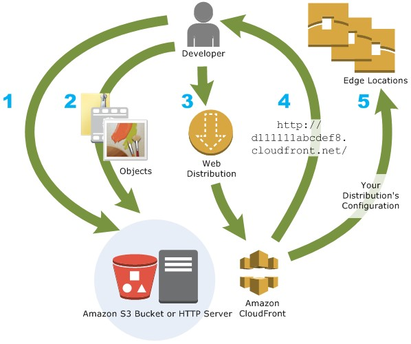
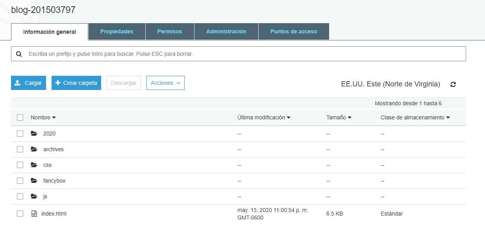
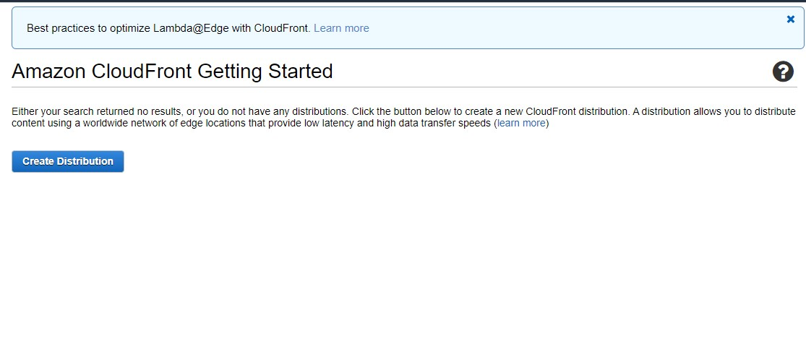
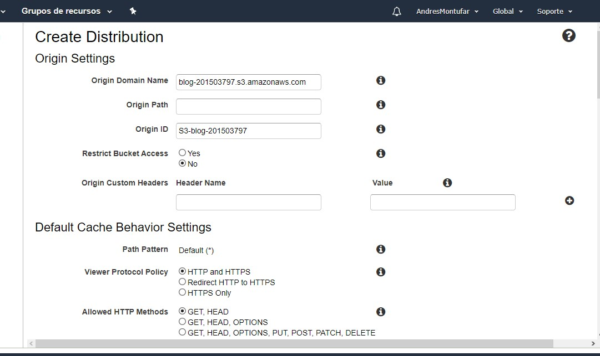
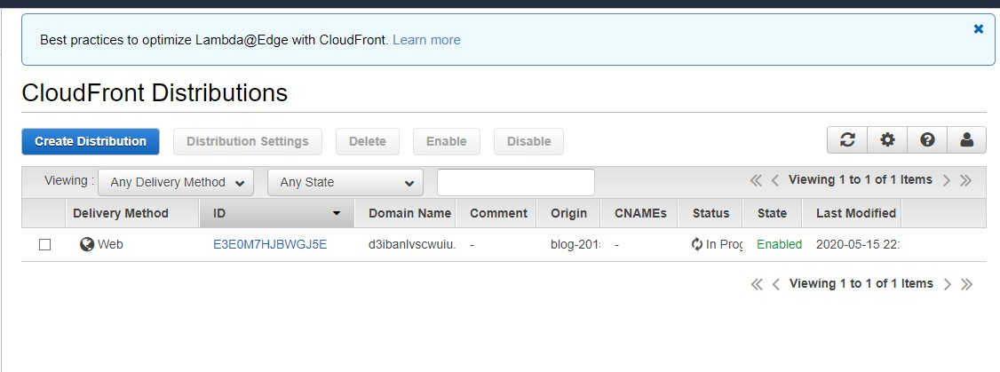
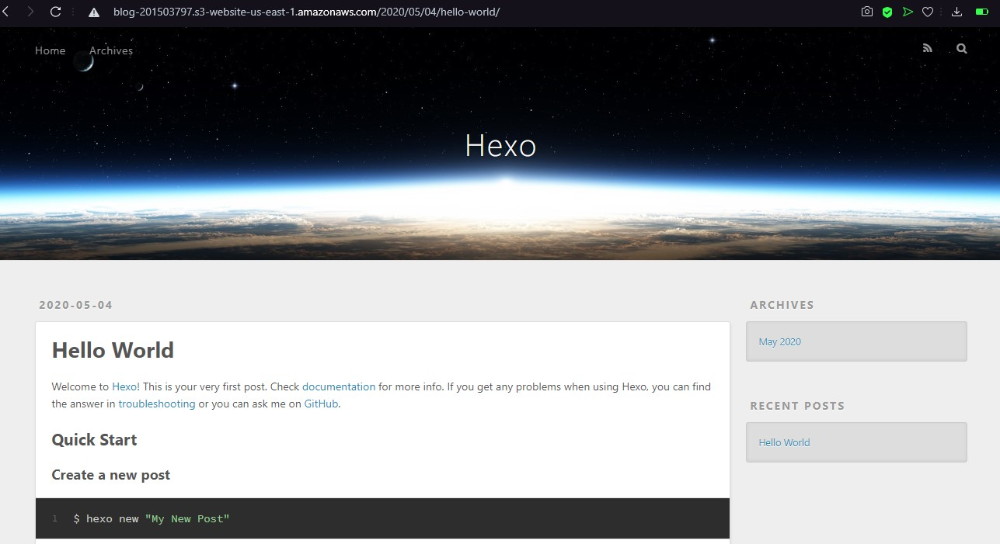

## Descripción de Amazon CloudFront
Es un servicio web utilizado para acelerar la distribución de contenido web, ya sea estático o dinámico. Entre estos entran archivos html, css, js o imágenes.
Se basa de una red mundial de centros de datos con la cual entrega el contenido web, cuando un usuario solicita el contenido, este se distribuye por medio de este servicio y lo redirige a la ubicación de borde que ofrece la mínima latencia.

## Configuraciones
### Creación de Bucket
Para utilizar este servicio primero que nada se debe crear un bucket, el cual va a contener una página web:

### Creación de Distribución
Luego de cargar la página web creamos una nueva distribución

Configuramos la distribución tal y como sea necesario para nosotros

Luego de crear la distribución podremos ver el estado de esta:

## Resultado

