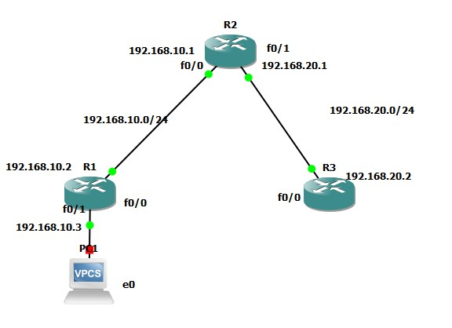

## Descripción de IP SLA
Es una herramienta con la que podemos hacer el análisis de servicios ip. Con esta podemos monitorear el tráfico de red de manera continua.
En este caso intentaremos monitorear paquetes ICMP de la siguiente topología:



## Configuración ruteo estático
Lo primero se tiene que configurar una ruta estática en el R1 hacia R2 con el siguiente comando:

``` bash
$ Conf t
$ ip route 192.168.10.1 255.255.255.0 192.168.10.2
```
## Configuración de una sonda
Ahora se configura una sonda de IP SLA con los siguientes comandos

``` bash
$  Conf t
$  ip sla 44
$  icmp-echo 172.16.2.115 source-interface f0/0
$  timeout 1000
$  frequency 2
$  exit
$  exit
$  ip sla schedule 44 life forever start-time now

```

Luego se necesita hacer un seguimiento de la sonda SLA y se asocia a la ruta estática creada anteriormente
``` bash
$ track 23 ip sla 44 reachability
```
