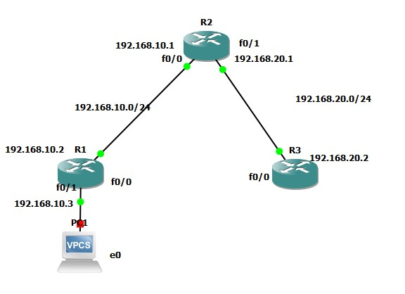
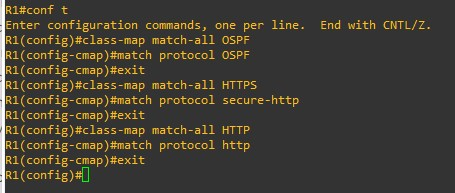
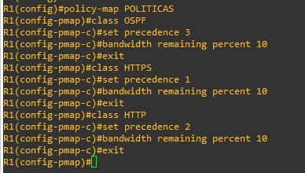
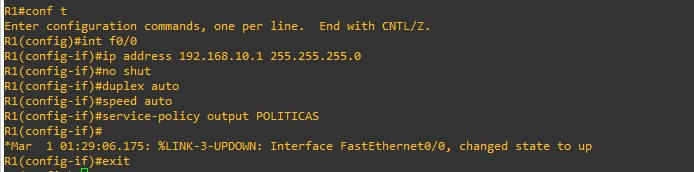

## Descripción de QoS
Como bien sabemos Quality of Service es una de las implementaciones más importantes que debemos aplicar en una red con mucho tráfico ya que puede verse afectada generando respuestas lentas de una red.
Al configurar QoS podemos definir precedencias para controlar mejor el tráfico y no afectar en ningún momento la experiencia del usuario y no afectar el ancho de banda.

Utilizando la siguiente topología, vamos a configurar QoS:



## Configuraciones
### Configuración de clases en Router R1
Configuramos las clases de los protocolos que vamos a utilizar dentro de nuestra red, en este caso vamos a configurar los protocolos OSPF, HTTP y HTTPS. Los comandos a utilizar son los siguientes:

``` bash
$ Conf t
$ class-map match-all OSPF
$ match protocol OSPF
$ exit
  
$ class-map match-all HTTPS
$ match protocol secure-http
$ exit
  
$ class-map match-all HTTP
$ match protocol http
$ exit
```


### Configuración de políticas
Ahora configuramos las políticas junto con su ancho de banda y su precedencia, vamos a utilizar un ancho de banda de 10Mbps
``` bash
$ Policy-map POLITICAS
$ Class OSPF
$ set precedence 3
$ bandwidth remaining percent 10
$ exit
$ Class HTTPS
$ set precedence 1
$ bandwidth remaining percent 10
$ exit
$ class HTTP
$ set precedence 2
$ bandwidth remaining percent 10
$ exit
```


### Configuración de interfaces
Ahora que ya tenemos las políticas creadas con su precedencia, tenemos que configurar la intefaz del router R1 ya que en este se configuraron las políticas

``` bash
$ Conf t
$ int f0/0
$ ip address 192.168.10.1 255.255.255.0
$ no shut
$ duplex auto
$ speed auto
$ service-policy output POLITICAS
$ exit
$ int f0/1
$ ip address 192.168.10.3 255.255.255.0
$ no shut
$ duplex auto
$ speed auto
$ service-policy input POLITICAS
$ exit

```

