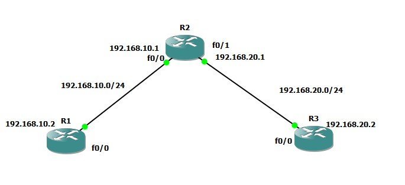
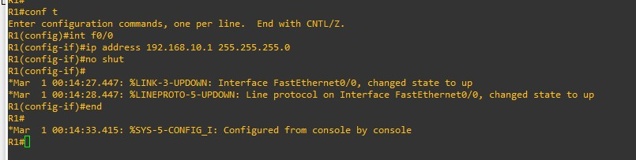
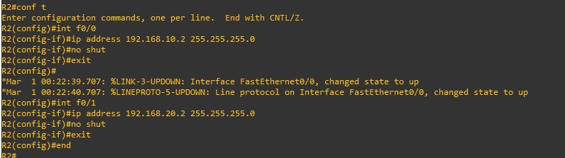
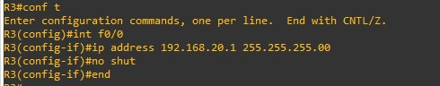
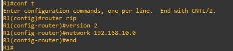
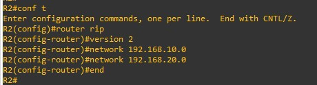
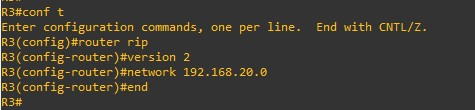
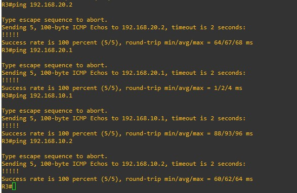

## Descripción
Para poder realizar un ruteo dinámico tenemos que definir una topología, en mi caso usaré la siguiente:



### Definición de redes y subredes
- **Dirección de red:**: La dirección de red que utilizaré será: 192.168.0.0/24
- **Subred**: Las subredes serán: 192.168.10.0/24 y 192.168.20/24

## Configuración de interfaces
### Configuración Router R1
Configuramos la interfaz del router con los siguientes comandos:
``` bash
$ Conf t
$ int f0/0
$ ip address 192.168.10.1 255.255.255.0
$ no shut
$ end
```


### Configuración Router R2
Configuramos las interfaces del router R2 con los siguientes comandos
``` bash
$ Conf t
$ int f0/0
$ ip address 192.168.10.2 255.255.255.0
$ no shut
$ exit
$ int f0/1
$ ip address 192.168.20.2 255.255.255.0
$ exit
$ end

```


### Configuración Router R3
Configuramos la interfaz del router con los siguientes comandos:
``` bash
$ Conf t
$ int f0/0
$ ip address 192.168.20.1 255.255.255.0
$ no shut
$ end
```


## Configuración de ruteo dinámico
Ahora debemos configurar el ruteo dinámico en cada uno de los routers con los siguientes comandos

### Router rip
``` bash
$ conf t
$ router rip
$ version 2
$ network 192.168.20.0
$ network 192.168.10.0
$ exit
```
#### Router 1


#### Router 2


#### Router 3


## Ping entre routers
Ahora que ya configuramos el enrutamiento dinámico RIP probamos hacer ping entre routers a cualquier ip asignada a las interfaces.

``` bash
$ Ping 192.168.10.1
$ Ping 192.168.10.2
$ Ping 192.168.20.1
$ Ping 192.168.20.2
```
#### RESULTADO


Como podemos observar podemos hacer ping a cualquier router por medio de las ips asignadas, eso significa que podemos conectarnos de un punto origen a un punto destino sin problemas.
